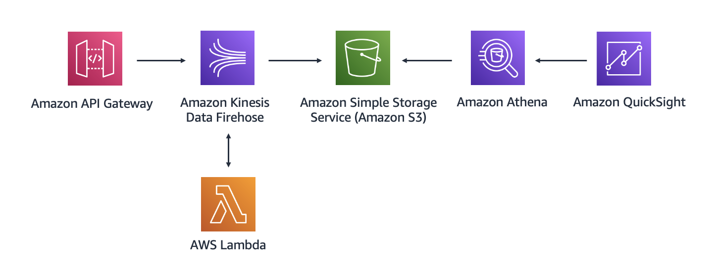

# aws-arch-course
Repository containing the exercises of the [**Architcting Solutions on AWS** Coursera course](https://www.coursera.org/learn/architecting-solutions-on-aws) using Serverless Framework.

## Week 1: Building a Proof of Concept for a Serverless Solution

This exercise provides you with instructions for how to build a proof of concept for a serverless solution in the AWS Cloud.

Suppose you have a customer that needs a serverless web backend hosted on AWS. The customer sells cleaning supplies and often sees spikes in demand for their website, which means that they need an architecture that can easily scale in and out as demand changes. The customer also wants to ensure that the application has decoupled application components.

The following architectural diagram shows the flow for the serverless solution that you will build.


In this architecture, you will use a REST API to place a database entry in the Amazon SQS queue. Amazon SQS will then invoke the first Lambda function, which inserts the entry into a DynamoDB table. After that, DynamoDB Streams will capture a record of the new entry in a database and invoke a second Lambda function. The function will pass the database entry to Amazon SNS. After Amazon SNS processes the new record, it will send you a notification through a specified email address.

### Replication Instructions

First, make sure to set up aws credentials and install Serverless Framework, instructions can be found in the [Serverless Framework Documentation](https://www.serverless.com/framework/docs/getting-started). Change directory to `w1-backend` and create a `secrets.yml` file to include your email address as follows:

```yaml
email: your-emain@somewhere.com
```

This file is excluded from the repository but is read from in the template to set up the SNS Topic subscription.

Then you can run the `sls deploy` command to deploy the proof-of-concept architecture. Remember to check your email to confirm the SNS Subscription so you are able to receive notifications when testing the application.

Since the RestAPI is created as a resource rather than as an Event, the endpoint is not displayed by the framework after a deployment but instead is included as a Stack Output. To see the endpoint you can:
 - Deploy with `sls deploy --verbose`
 - Display service information after deployment with `sls info --verbose`
 - Go get it from the AWS Management Console

Now you have the endpoint to test the Proof of Concept!

## Week 2: Building a Proof of Concept for Data Analytics

This week, you will design an architecture for a customer who needs an analytics solution to ingest, store, and visualize clickstream data. The customer is a restaurant owner who wants to derive insights for all menu items that are ordered in their restaurant. Because the customer has limited staff for running and maintaining this solution, you will build a proof of concept by using managed services on AWS.

The following architectural diagram shows the flow that you will follow.



In this architecture, you use API Gateway to ingest clickstream data. Then, the Lambda function transforms the data and sends it to Kinesis Data Firehose. The Firehose delivery stream places all files in Amazon S3. Then, you use Amazon Athena to query the files. Finally, you use Amazon QuickSight to transform data into graphics

### Replication Instructions

Since the RestAPI is created as a resource rather than as an Event, the endpoint is not displayed by the framework after a deployment but instead is included as a Stack Output. To see the endpoint you can:
 - Deploy with `sls deploy --verbose`
 - Display service information after deployment with `sls info --verbose`
 - Go get it from the AWS Management Console

### Test Records

You can try the service by sending these test records through the API:

**Entree 1**
```json
{
    "element_clicked":"entree_1",
    "time_spent":12,
    "source_menu":"restaurant_name",
    "created_at":"2022–09–11 23:00:00"
}
```

**Entree 4**
```json
{
    "element_clicked":"entree_4",
    "time_spent":32,
    "source_menu":"restaurant_name",
    "createdAt":"2022–09–11 23:00:00"
}
```

**Drink 1**
```json
{
    "element_clicked":"drink_1",
    "time_spent":15,
    "source_menu":"restaurant_name",
    "created_at":"2022–09–11 23:00:00"
}
```

**Drink 3**
```json
{
    "element_clicked":"drink_3",
    "time_spent":14,
    "source_menu":"restaurant_name",
    "created_at":"2022–09–11 23:00:00"
}
```