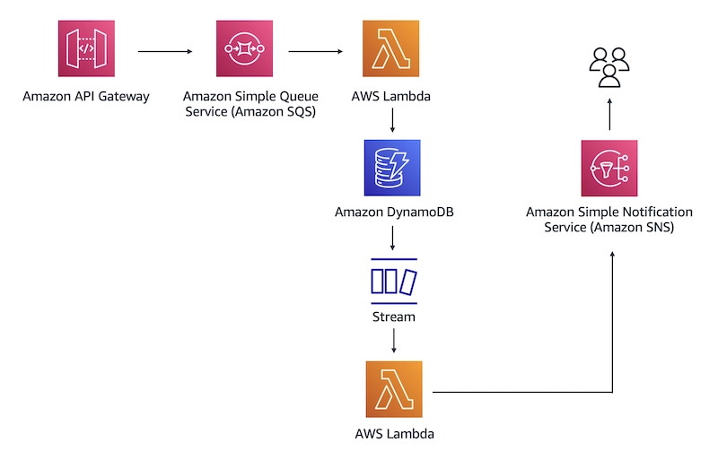

# aws-arch-course
Repository containing the exercises of the [**Architcting Solutions on AWS** Coursera course](https://www.coursera.org/learn/architecting-solutions-on-aws) using Serverless Framework.

## Week 1: Building a Proof of Concept for a Serverless Solution

This exercise provides you with instructions for how to build a proof of concept for a serverless solution in the AWS Cloud.

Suppose you have a customer that needs a serverless web backend hosted on AWS. The customer sells cleaning supplies and often sees spikes in demand for their website, which means that they need an architecture that can easily scale in and out as demand changes. The customer also wants to ensure that the application has decoupled application components.

The following architectural diagram shows the flow for the serverless solution that you will build.



In this architecture, you will use a REST API to place a database entry in the Amazon SQS queue. Amazon SQS will then invoke the first Lambda function, which inserts the entry into a DynamoDB table. After that, DynamoDB Streams will capture a record of the new entry in a database and invoke a second Lambda function. The function will pass the database entry to Amazon SNS. After Amazon SNS processes the new record, it will send you a notification through a specified email address.

### Replication Instructions

First, make sure to set up aws credentials and install Serverless Framework, instructions can be found in the [Serverless Framework Documentation](https://www.serverless.com/framework/docs/getting-started). Change directory to `w1-backend` and create a `secrets.yml` file to include your email address as follows:

```yaml
email: your-emain@somewhere.com
```

This file is excluded from the repository but is read from in the template to set up the SNS Topic subscription.

Then you can run the `sls deploy` command to deploy the proof-of-concept architecture. Remember to check your email to confirm the SNS Subscription so you are able to receive notifications when testing the application.
