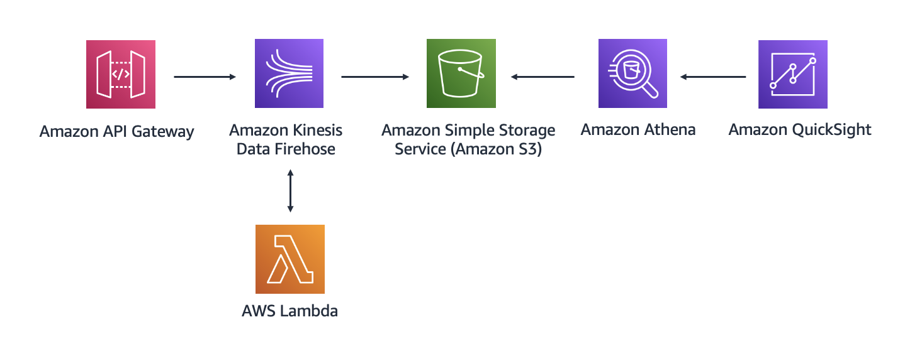

# Week 2: Building a Proof of Concept for Data Analytics

This week, you will design an architecture for a customer who needs an analytics solution to ingest, store, and visualize clickstream data. The customer is a restaurant owner who wants to derive insights for all menu items that are ordered in their restaurant. Because the customer has limited staff for running and maintaining this solution, you will build a proof of concept by using managed services on AWS.

The following architectural diagram shows the flow that you will follow.



In this architecture, you use API Gateway to ingest clickstream data. Then, the Lambda function transforms the data and sends it to Kinesis Data Firehose. The Firehose delivery stream places all files in Amazon S3. Then, you use Amazon Athena to query the files. Finally, you use Amazon QuickSight to transform data into graphics

## Replication Instructions

Since the RestAPI is created as a resource rather than as an Event, the endpoint is not displayed by the framework after a deployment but instead is included as a Stack Output. To see the endpoint you can:
 - Deploy with `sls deploy --verbose`
 - Display service information after deployment with `sls info --verbose`
 - Go get it from the AWS Management Console

## Test Records

You can try the service by sending these test records through the API:

**Entree 1**
```json
{
    "element_clicked":"entree_1",
    "time_spent":12,
    "source_menu":"restaurant_name",
    "created_at":"2022–09–11 23:00:00"
}
```

**Entree 4**
```json
{
    "element_clicked":"entree_4",
    "time_spent":32,
    "source_menu":"restaurant_name",
    "createdAt":"2022–09–11 23:00:00"
}
```

**Drink 1**
```json
{
    "element_clicked":"drink_1",
    "time_spent":15,
    "source_menu":"restaurant_name",
    "created_at":"2022–09–11 23:00:00"
}
```

**Drink 3**
```json
{
    "element_clicked":"drink_3",
    "time_spent":14,
    "source_menu":"restaurant_name",
    "created_at":"2022–09–11 23:00:00"
}
```

> **Note on QuickSight**: This week template does not include QuickSight resources due to lack of documentacion about how to create them with cloud formation. Though there is already support for QuickSight resources, it is not clear how to create an Analysis nor a Template due to circular dependency issues as stated in this [StackOverflow comment](https://stackoverflow.com/a/69270061) and [this other comment](https://github.com/aws-cloudformation/cloudformation-coverage-roadmap/issues/274#issuecomment-1192475234) in the issue referenced in the former.
>
> [This page](https://devops.learnquicksight.online/quicksight-via-cloudformation.html) provides an example using lambda as a custom resource to create QuickSight resources but having already a template created in the account.