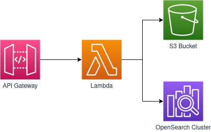

# Week 2: Creating an Amazon OpenSearch Service Cluster

You are tasked with creating a way to ingest data into a data lake that’s hosted on AWS. The data lake uses Amazon S3 as the storage layer and OpenSearch Service for index and search capabilities.

You use Amazon API Gateway to ingest the data that is sent from the sensor, which invokes a Lambda function. This Lambda function takes the payload of the request. First, it writes a file to an S3 bucket. The file name is a combination of the sensor ID and the timestamp. The file contents send the sensorID, the timestamp, and the temperature reading. The Lambda function then loads the record to OpenSearch Service.



## Replication Instructions

Install the `serverless-python-requirements` plugin to handle dependecies of the lambda function.

```
sls plugin install -n serverless-python-requirements
```

Create a `secrets.yml` file to include your ip address as follows:

```yaml
ipv4: 0.0.0.0 # replace with your ip
```