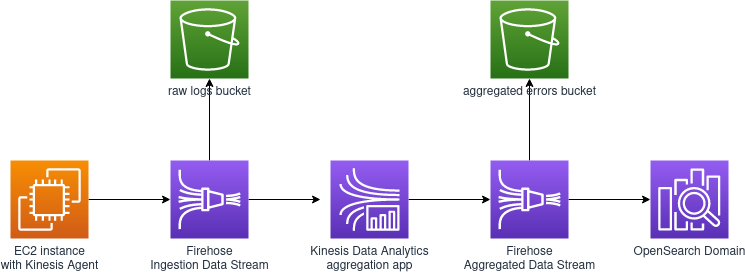

# Building a log-analytics solution with Amazon Kinesis

Imagine that you are a systems administrator who is responsible for the health of a large, web-server cluster. As part of your duties, you need to constantly monitor the server access logs for anything unusual. Normally, you would send these logs to a log server and parse the data with your scripting skills. However, the cluster has grown exponentially larger within the last few months. It now requires a more robust solution to keep up with the demand. You are tasked with creating a log-analytics solution on AWS that is extremely scalable.

In this exercise, you produce data with the Kinesis agent, which runs on an EC2 instance. The agent simulates one of the web servers in your organization’s large server farm. Then, you ingest some dummy access logs with Kinesis Data Firehose. You move those logs to Amazon S3. Then, you use Kinesis Data Analytics to get data and aggregate data points for Kinesis Data Analytics to output. You send the aggregated data to another Kinesis Data Firehose delivery stream that outputs the data to Amazon OpenSearch Service. Finally, you visualize the data with OpenSearch Dashboards. The following schematic provides an overview of your workflow:

## Replication Instructions

Since this week's architecture doesn't have lambda functions and a CloudFormation stack is provided with an EC2 instance to produce dummy data, this exercise is done using CloudFormation only with the provided stack as a Nested Stack.
