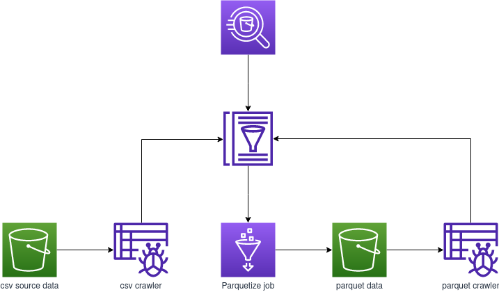

# Processing Data in a Data Lake

In this exercise, you define a database and configure a crawler to explore data in an Amazon S3 bucket. Next, you create a table. You then transform the comma-separated values (CSV) file into Parquet and create a table for the Parquet data. Finally, you query the data with Amazon Athena.

