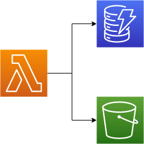

# Testing permissions

Scenario: Working with AWS means that you should be familiar with how services integrate with each other. In the upcoming challenge, you will create an architecture with a Lambda function that inserts a test item into a DynamoDB table and uploads a test object to an S3 bucket. The Lambda function will use an IAM role for credentials. You must ensure that the S3 bucket, DynamoDB table, and Lambda function are configured correctly to all work together.

## Replication Instructions

Just deploying the given template with `sls deploy` is enough for this exercise.

You can also invoke the lambda function using Serverless Framework with `sls invoke -f upload` and then check that the s3 bucket has the object and dynamodb the item.

Finally you can clean up the resources with `sls remove`, make sure you empty the s3 bucket first.

> **Note**: This is a hello world kind of exercise, its purpose was to configure the resources permissions correctly without being given explicit instructions