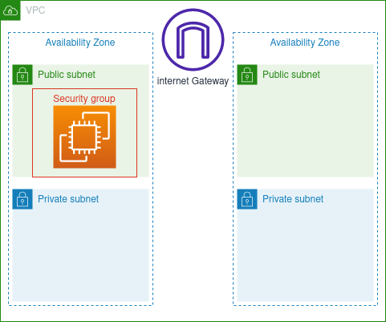

# Creating a Network

You will create a VPC with two public and two private subnets, then launch an EC2 instance in to the public subnet. A sample application will be loaded onto the instance through user data scripts so that you can check whether your instance is accessible from the internet.



## Replication Instructions

Since this week's architecture doesn't have lambda functions, this exercise is done using CloudFormation.

Use the following command to deploy the stack:

```
aws cloudformation deploy \
--template-file network-stack.yml \
--stack-name network-stack 
```

To detelete the stack, use the following command and remember to empty the S3 bucket before.

```
aws cloudformation delete-stack \
--stack-name network-stack
```
